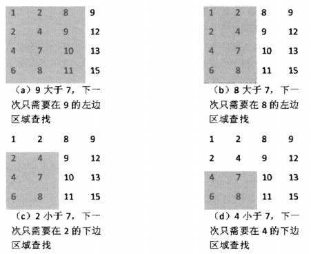

#链接
------- 

>牛客OJ：[二维数组中的查找](http://www.nowcoder.com/practice/abc3fe2ce8e146608e868a70efebf62e?tpId=13&tqId=11154&rp=1&ru=/ta/coding-interviews&qru=/ta/coding-interviews/question-ranking)
>
>九度OJ：http://ac.jobdu.com/problem.php?pid=1384
>
>GitHub代码：[gatiemee/CodingInterviews--003二维数组中的查找](https://github.com/gatieme/CodingInterviews/tree/master/003-%E4%BA%8C%E7%BB%B4%E6%95%B0%E7%BB%84%E4%B8%AD%E7%9A%84%E6%9F%A5%E6%89%BE)
>
>CSDN题解：[剑指Offer--003--二维数组中的查找](http://blog.csdn.net/gatieme/article/details/51100125)


#题意
-------

**题目描述**

>在一个二维数组中，每一行都按照从左到右递增的顺序排序，每一列都按照从上到下递增的顺序排序。请完成一个函数，输入这样的一个二维数组和一个整数，判断数组中是否含有该整数。 

**输入描述**

>array： 待查找的二维数组
>target：查找的数字

**输出描述**
>查找到返回true，查找不到返回false

#暴力解法
-------
暴力的解法，肯定是用两层大循环来查找，不多说直接上代码
```cpp
#include <iostream>
#include <vector>

using namespace std;


class Solution
{
public:
    bool Find(vector<vector<int> > array,int target)
    {
        int row = 0, col = 0, t = 0;
        bool isFound = false;

        for(int i = 0; i < array.size( ) ; ++i)
        {
            for(int j = 0; j < array[i].size( ); ++j)
            {
                //边输入边验证
                if(false == isFound && target == array[i][j])
                {
                    //已经找到后就没必要再找了
                    isFound = true;
                }
            }
        }

        return isFound;

    }
};

```


#分治解法
-------

##思路
-------

从数组中选取数字，和目标数字的关系有三种情况：=，<或>。

1.    如果是等于则查找成功；

2.    如果是数组中元素小于要查找的数字，说明要查找的数字应该在当前位置的右边或下边。

3.    如果是数组中元素大于要查找的数字，说明要查找的数字应该在当前位置的左边或上边。


但是这两个区域还有可能有重叠，比如右边或下边会在右下角有重叠。

解决方法：

*    如果查找从右上角开始，如果要查找的数字不在右上角，则每次可以剔除一列或一行。

*    也可以从左下角开始，但是不能从左上角或者右下角开始。


如图，即是我们在二维数组中查找7的轨迹


　


##从右上角的元素出发
-------

比如我们从右上角的数据开始出发

*    比他小的数必定在它的左侧，就往左找

*   比他大的数必定在它的下侧，就往下找 

```cpp
#include <iostream>
#include <vector>

using namespace std;



#define __main main

class Solution
{
public:
    bool Find(vector<vector<int> > array,int target)
    {
        bool res = false;
        int row = array.size( );
        int col = array[0].size( );

        //  我们从右上角的元素找起来
        //  如果查找的元素比当前位置元素小, 就向左走
        //  如果查找的元素比当前位置元素大, 就向下走
        for(int i = 0, j = col -1;
            (i >=0 && i < row) && (j >= 0 && j < col);)
        {
            if(target == array[i][j])
            {
                res = true;
                break;
            }
            else if(target < array[i][j])     // 小的元素在当前位置左侧
            {
#ifdef __tmain
                cout <<target <<" < " <<array[i][j] <<" turn left" <<endl;
#endif // __tmain

                j--;
            }
            else
            {
#ifdef __tmain
                cout <<target <<" > " <<array[i][j] <<" turn down" <<endl;
#endif // __tmain
                i++;
            }
        }
        return res;
    }
};




int __main()
{
    int a1[] = { 1, 2, 8, 9, };
    int a2[] = { 2, 4, 9, 12, };
    int a3[] = { 4, 7, 10, 13, };
    int a4[] = { 6, 8, 11, 15, };
    vector<vector<int>> array;
    array.push_back(vector<int>(a1, a1 + 4));
    array.push_back(vector<int>(a2, a2 + 4));
    array.push_back(vector<int>(a3, a3 + 4));
    array.push_back(vector<int>(a4, a4 + 4));

    Solution solu;
    cout <<solu.Find(array, 7) <<endl;
    return 0;
}
```


##从左下角的元素出发
-------


比如我们从左下角的数据开始出发

*    比他小的数必定在它的上侧，就往上找

*   比他大的数必定在它的右侧，就往右找 

```cpp
class Solution
{
public:
    bool Find(vector<vector<int> > array,int target)
    {
        bool res = false;
        int row = array.size( );
        int col = array[0].size( );

        //  我们从右上角的元素找起
        //  如果查找的元素比当前位置元素小, 就向上走
        //  如果查找的元素比当前位置元素大, 就向右走
        for(int i = row - 1, j = 0;
            (i >=0 && i < row) && (j >= 0 && j < col);)
        {
            if(target == array[i][j])
            {
                res = true;
                break;
            }
            else if(target < array[i][j])     // 小的元素在当前位置上侧
            {
#ifdef __tmain
                cout <<target <<" < " <<array[i][j] <<" turn up" <<endl;
#endif // __tmain

                i--;
            }
            else
            {
#ifdef __tmain
                cout <<target <<" > " <<array[i][j] <<" turn rigt" <<endl;
#endif // __tmain
                j++;
            }
        }
        return res;
    }
};

```

