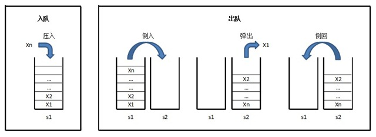

#链接
------- 

>牛客OJ：[用两个栈实现队列](http://www.nowcoder.com/practice/54275ddae22f475981afa2244dd448c6?tpId=13&tqId=11158&rp=1&ru=/ta/coding-interviews&qru=/ta/coding-interviews/question-rankingg) 
>
>九度OJ：http://ac.jobdu.com/problem.php?pid=1512
>
>GitHub代码： [007-用两个栈实现队列](https://github.com/gatieme/CodingInterviews/tree/master/006-%E9%87%8D%E5%BB%BA%E4%BA%8C%E5%8F%89%E6%A0%91)  
>
>CSDN题解：[剑指Offer--007-用两个栈实现队列](http://blog.csdn.net/gatieme/article/details/51112580)


| 牛客OJ | 九度OJ | CSDN题解 | GitHub代码 |
| ------------- |:-------------:| -----:| -----:|
|[用两个栈实现队列](http://www.nowcoder.com/practice/54275ddae22f475981afa2244dd448c6?tpId=13&tqId=11158&rp=1&ru=/ta/coding-interviews&qru=/ta/coding-interviews/question-rankingg) | [1512-用两个栈实现队列](http://ac.jobdu.com/problem.php?pid=1512)   | [剑指Offer--007-用两个栈实现队列](http://blog.csdn.net/gatieme/article/details/51112580) | [006-重建二叉树](https://github.com/gatieme/CodingInterviews/tree/master/006-%E9%87%8D%E5%BB%BA%E4%BA%8C%E5%8F%89%E6%A0%91)  |

<br>
**您也可以选择[回到目录-剑指Offer--题集目录索引](http://blog.csdn.net/gatieme/article/details/51916802)**


#题意
-------
题目描述


>用两个栈来实现一个队列，完成队列的Push和Pop操作。 队列中的元素为int类型。

#分析
-------

始终维护s1作为**存储空间**，以s2作为**临时缓冲区**。

*    入队时，将元素压入s1。

*    出队时，将s1的元素逐个“倒入”（弹出并压入）s2，将s2的顶元素弹出作为出队元素，之后再将s2剩下的元素逐个“倒回”s1。

见下面示意图：



上述思路，可行性毋庸置疑。但有一个细节是可以优化一下的。即：在出队时，将s1的元素逐个“倒入”s2时，原在s1栈底的元素，不用“倒入”s2（即只“倒”s1.Count()-1个），可直接弹出作为出队元素返回。这样可以减少一次压栈的操作。约有一半人，经提示后能意识到此问题。
 
上述思路，有些变种，如：

*    入队时，先判断s1是否为空，如不为空，说明所有元素都在s1，此时将入队元素直接压入s1；如为空，要将s2的元素逐个“倒回”s1，再压入入队元素。

*    出队时，先判断s2是否为空，如不为空，直接弹出s2的顶元素并出队；如为空，将s1的元素逐个“倒入”s2，把最后一个元素弹出并出队。
有些人能同时想到大众方法和变种，应该说头脑还是比较灵光的。
 
相对于第一种方法，变种的s2好像比较“懒”，每次出队后，并不将元素“倒回”s1，如果赶上下次还是出队操作，效率会高一些，但下次如果是入队操作，效率不如第一种方法。我有时会让面试者分析比较不同方法的性能。我感觉（没做深入研究），入队、出队操作随机分布时，上述两种方法总体上时间复杂度和空间复杂度应该相差无几（无非多个少个判断）。
 
但是每次倒来倒去的还是效率不太好，因此我们思考出了如下的变种

始终维护s1作为**输入栈**，以s2作为**输出栈**

*    入队时，将元素压入s1。

*    出队时，判断s2是否为空，如不为空，则直接弹出顶元素；如为空，则将s1的元素逐个“倒入”s2，把最后一个元素弹出并出队。
这个思路，避免了反复“倒”栈，仅在需要时才“倒”一次。但在实际面试中很少有人说出，可能是时间较少的缘故吧。

#代码
-------
```cpp
#include <iostream>
#include <stack>
using namespace std;

//  调试开关
#define __tmain main

#ifdef __tmain

#define debug cout

#else

#define debug 0 && cout

#endif // __tmain

class Solution
{
public:
    void push(int node)
    {
        stackIn.push(node);
    }

    int pop()
    {
        int node = -1;

        //  两个栈都是NULL的时候，整个队列为空
        if(this->empty( ) == true)
        {
            debug <<"整个队列为NULL" <<endl;

            return -1;
        }
        else
        {
            //  否则队列中有元素
            //  此时分两种情况，
            //  当输出栈不为空的时候, 直接将输出栈中元素弹出即可
            //  当输出栈为NULL, 但是输入栈不为空的时候，需要将输入栈的元素全部倒入输出栈中

            if(stackOut.empty() == true)     //  此时输出栈为空, 输入栈必不为空
            {
                //  此时缓冲栈（输出栈）中没有元素
                //  需要将输入栈中的元素倒入输出栈
                // 看输入栈中有没有元素

                //  否则将元素从输入栈导入输出栈
                while(stackIn.empty( ) != true)
                {
                    node = stackIn.top( );
                    stackIn.pop( );
                    stackOut.push(node);
                    debug <<node <<"导入输出栈" <<endl;
                }
            }

            node = stackOut.top( );
            stackOut.pop( );

            debug <<"队头元素" <<node <<endl;
        }

        return node;
    }

    bool empty( )
    {
        return (stackIn.empty() == true && stackOut.empty() == true);
    }

private:
    stack<int> stackIn;
    stack<int> stackOut;
};


int __tmain( )
{
    Solution solu;
    solu.push(1);
    solu.push(2);
    solu.push(3);
    solu.push(4);

    int node;
    while(solu.empty() != true)
    {

        cout <<solu.pop( );
    }

    return 0;
}

```
