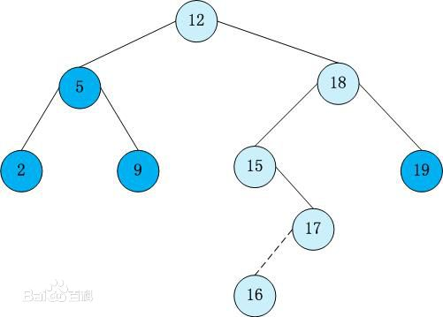

#链接
-------
>牛客OJ：[二叉搜索树的后序遍历序列](http://www.nowcoder.com/practice/a861533d45854474ac791d90e447bafd?tpId=13&tqId=11176&rp=2&ru=/ta/coding-interviews&qru=/ta/coding-interviews/question-ranking)
>
>九度OJ：http://ac.jobdu.com/problem.php?pid=1367
>
>GitHub代码： [024-二叉搜索树的后序遍历序列](https://github.com/gatieme/CodingInterviews/tree/master/024-二叉搜索树的后序遍历序列)
>
>CSDN题解：[剑指Offer--024-二叉搜索树的后序遍历序列](http://blog.csdn.net/gatieme/article/details/51213665)


| 牛客OJ | 九度OJ | CSDN题解 | GitHub代码 |
| ------- |:-------:| -----:|:-------:|
|[二叉搜索树的后序遍历序列](http://www.nowcoder.com/practice/a861533d45854474ac791d90e447bafd?tpId=13&tqId=11176&rp=2&ru=/ta/coding-interviews&qru=/ta/coding-interviews/question-ranking) | [1523-二叉搜索树的后序遍历序列](http://ac.jobdu.com/problem.php?pid=1367) | [剑指Offer--024-二叉搜索树的后序遍历序列](http://blog.csdn.net/gatieme/article/details/51213665) | [024-二叉搜索树的后序遍历序列](https://github.com/gatieme/CodingInterviews/tree/master/024-二叉搜索树的后序遍历序列) |


<br>**您也可以选择[回到目录-剑指Offer--题集目录索引](http://blog.csdn.net/gatieme/article/details/51916802)**


#题意
-------

**题目描述**

>输入一个整数数组，判断该数组是不是某二叉搜索树的后序遍历的结果。如果是则输出Yes,否则输出No。假设输入的数组的任意两个数字都互不相同。

#分析
-------
二叉排序树或者是一棵空树，或者是具有下列性质的二叉树：


1.    若左子树不空，则左子树上所有结点的值均小于它的根结点的值；


2.    若右子树不空，则右子树上所有结点的值均大于或等于它的根结点的值；


3.    左、右子树也分别为二叉排序树；


4.    没有键值相等的节点。


注意：左子树上所有结点的值均小于它的根结点的值

**对一棵二叉搜索树进行中序遍历（左根右）可得到一个关键字递增有序序列**

那么二叉搜索树的后序序列（左右根）右什么特征呢？





比如我们的这个二叉排序树


>中序序列 2, 5, 9, 12, 15, 16, 17, 18, 19
>
>后序序列 2, 9, 5, 16, 17, 15, 19, 18, 12


如果按照后序遍历，先左后右最后自己的顺序来遍历树，数组的最后一个元素肯定是自己（父节点），然后剩余的部分分成两个部分，第一部分都比自己小（左子树部分），第二部分都比自己大（右子树部分），因此套用这个关系就可以循环检验出是否是二叉搜索树的后序遍历了

#根（最后一个节点）前面被划分为小于它（左子树）和大于它（右子树）的两部分
-------

<font color=#00ff22>BST的后序序列的合法序列是

*    对于一个序列S，最后一个元素是x （也就是根）

如果去掉最后一个元素的序列为T，那么T满足：

*    T可以分成两段，前一段（左子树）小于x，后一段（右子树）大于x，

*    且这两段（子树）都是合法的后序序列。

完美的递归定义</font>

##暴力实现
-------

最坏的方式就是我们从后往前，把每个元素都当作一个根节点，循环判断其是否满足二叉排序树后序的规则

```cpp
class Solution
{
public:
	//下面这种迭代的方法时间复杂度为O(n^2)
	bool VerifySquenceOfBST_Iteratively(const vector<int>& sequence) {
		int left = 0, right = sequence.size() - 1;
		while (left < right && right != 0) {
			//循环结束时，left是第一个大于根的元素的位置，即右子树首元素下标
			while (sequence[left] < sequence[right])
				left++;
			//循环结束时，left越过右子树末节点，到达根节点
			while (sequence[left] > sequence[right])
				left++;

			//如果没有到达根节点，说明不满足左子树所有节点小于根节点，右子树所有节点大于根节点的条件
			if (left < right)
				return false;
			left = 0;

			right--;
		}

		//如果循环一直到right == 0才终止, 说明以所有节点为根节点，左侧序列均满足后序遍历序列的条件
		return (right == 0) ? true : false;
	}
};
```

该算法的把每个节点都当作根节点判断一趟，共进行N趟
没趟需要判断当前节点之前的所有节点，因此复杂度= $N*(N-1)/2=O(n)$


##递归实现
-------
```cpp
#include <iostream>
#include <vector>

using namespace std;

//  调试开关
#define __tmain main

#ifdef __tmain

#define debug cout

#else

#define debug 0 && cout

#endif // __tmain

class Solution
{
public:
    bool VerifySquenceOfBST(vector<int> sequence)
    {
        if(sequence.size( ) == 0)
        {
            return false;
        }

        return judge(sequence, 0, sequence.size( ) - 1);
    }

    /// 2, 9, 5, 16, 17, 15, 19, 18, 12
    bool judge(vector<int>  &sequence, int left, int right)
    {
        if(left >= right)
        {
            return true;
        }

        /// 后一半的元素都比根元素大
        int mid = right - 1;
        while (sequence[mid] > sequence[right])
        {
            mid--;
        }
        /// 那么前面的元素都应该比根小
        int i = left;
        while (i < mid && sequence[i] < sequence[right])
        {
            i++;
        }
        if (i < mid)
        {
            return false;
        }
#ifdef __tmain
        printf("left : ");
        for(int i = left; i <= mid; i++)
        {
            cout <<sequence[i] <<" ";
        }
        cout <<endl;
        printf("right : ");
        for(int i = mid + 1; i < right; i++)
        {
            cout <<sequence[i] <<" ";
        }
        cout <<endl;
        cout <<"root : " <<sequence[right] <<endl;
#endif // __tmain

        ///  这样我们就划分出区间
        ///  [left, mid] 是左子树
        ///  [mid + 1, right - 1] 是右子树
        ///  right 是根节点
        return judge(sequence, left, mid) && judge(sequence, mid + 1, right - 1);
    }
};


int __tmain( )
{

    int a[] = { 2, 9, 5, 16, 17, 15, 19, 18, 12, };

    vector<int> vec(a, a + 9);

    Solution solu;
    cout <<solu.VerifySquenceOfBST(vec) <<endl;
    return 0;
}
```

#维护最大值
-------

```cpp

class Solution {
public:
    ///  后序是 左右根
    ///  那么我们的节点
    bool VerifySquenceOfBST(vector<int> sequence)
    {
        if(sequence.size( ) == 0)
        {
            return false;
        }
        int max = 0;
        stack<int> s;
        int it = sequence.size( ) - 1;
        do
        {
            s.push(sequence[it]);
            it--;
        }while(it >= 0 && sequence[it] > sequence[it + 1]);

        max = s.top( );

        for(;it >= 0; it--)
        {
            debug <<"curr = " <<sequence[it] <<", max = " <<max <<endl;

            if(max < sequence[it])  //  前面有元素比最大值还大，肯定不满足要求
            {
                return false;
            }


            while(s.empty( ) != true && s.top( ) > sequence[it])
            {

                max = s.top();
                cout <<"max = " <<max <<endl;
                s.pop();
            }
            s.push(sequence[it]);
        }
        return true;
    }
};


int __tmain( )
{
//     10
//   6    14
//  8   12  16
//4


    int a[] = { 2, 9, 5, 16, 17, 15, 19, 18, 12, };

    vector<int> vec(a, a + 9);

    Solution solu;
    cout <<solu.VerifySquenceOfBST(vec) <<endl;
    return 0;
}
```

#判断左右子树
-------
```cpp
class Solution {
public:
	/*
	step1：最后一个为根节点；
	step2：从根节点的左边开始往前遍历，找到第一个比它大的节点作为右子树，记为right
	step3：从右子树的左边开始往前遍历，找到第一个比它小的节点作为左子树，记为left
	step4：判断( left, right )中的值是否都比根节点大，如果有比根节点小的则返回false
	step5: 判断( 0, left )中的值是否都比根节点小，如果有比根节点大的则返回false
	step6: 返回true

	时间复杂度：O(n), 空间复杂度: O(1)
	没有证明过，但是代码通过了，求反例，心里没底
	*/
	bool VerifySquenceOfBST(vector<int> sequence) {
		if (sequence.empty()) return true;
		int len = sequence.size();

		int left = -1, right = -1;
		for (int i = len - 2; i >= 0; --i)
		{
			if (right == -1 && sequence[i] > sequence[len - 1])
                right = i;
			if (left == -1 && sequence[i] < sequence[len - 1])
                left = i;
		}
        cout <<"left = " <<left <<", right = " <<right <<endl;
		for (int i = right - 1; i > left; --i)
        {
            if (sequence[i] < sequence[len - 1])
            {
                return false;
            }
        }
		for (int i = left - 1; i > 0; --i)
		{
			if (sequence[i] > sequence[len - 1])
            {

                return false;
            }

        }
		return true;
	}
};
```

