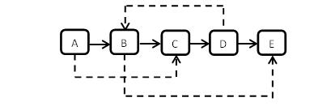
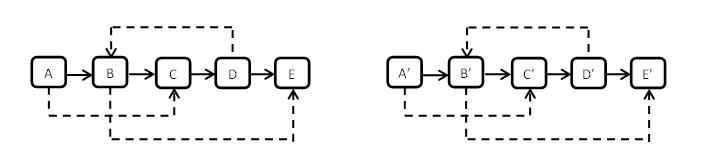
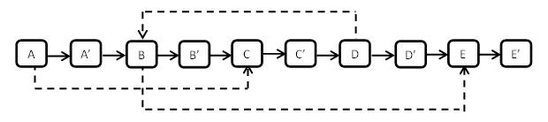

#链接
------- 
<<<<<<< HEAD

[牛客剑指Offer题目列表](http://www.nowcoder.com/ta/coding-interviews?page=)

[九度OJ剑指Offer题目列表](http://ac.jobdu.com/hhtproblems.php)


| 题目 | 题解 | 代码 |
| ------------- |:-------------:| -----:|
| [二维数组中的查找](http://www.nowcoder.com/practice/abc3fe2ce8e146608e868a70efebf62e?tpId=13&tqId=11154&rp=1&ru=/ta/coding-interviews&qru=/ta/coding-interviews/question-ranking) |
=======
>牛客OJ：[复杂链表的复制](http://www.nowcoder.com/practice/f836b2c43afc4b35ad6adc41ec941dba?tpId=13&tqId=11178&rp=2&ru=%2Fta%2Fcoding-interviews&qru=%2Fta%2Fcoding-interviews%2Fquestion-ranking)
> 
>九度OJ：http://ac.jobdu.com/problem.php?pid=1524
> 
>GitHub代码： [026-复杂链表的复制](https://github.com/gatieme/CodingInterviews/tree/master/026-复杂链表的复制)
>
>CSDN题解：[剑指Offer--026-复杂链表的复制](http://blog.csdn.net/gatieme/article/details/51227939)


| 牛客OJ | 九度OJ | CSDN题解 | GitHub代码 | 
| ------------- |:-------------:| -----:| 
|[复杂链表的复制](http://www.nowcoder.com/practice/f836b2c43afc4b35ad6adc41ec941dba?tpId=13&tqId=11178&rp=2&ru=%2Fta%2Fcoding-interviews&qru=%2Fta%2Fcoding-interviews%2Fquestion-ranking) | [1524-复杂链表的复制](http://ac.jobdu.com/problem.php?pid=1524) | [剑指Offer--026-复杂链表的复制](http://blog.csdn.net/gatieme/article/details/51227939) | [026-复杂链表的复制](https://github.com/gatieme/CodingInterviews/tree/master/026-复杂链表的复制) |

<br>**您也可以选择[回到目录-剑指Offer--题集目录索引](http://blog.csdn.net/gatieme/article/details/51916802)**


#题意
-------

**题目描述**

>输入一个复杂链表（每个节点中有节点值，以及两个指针，一个指向下一个节点，另一个特殊指针指向任意一个节点）。
>
>要求你编写函数复制这个复杂链表


<font color=#00ffff>复杂链表如下图所示</font>


<font color=#00ffff>复制完后的复杂链表如下图所示</font>



#暴力方法
-------
最简单暴力的方法：

很明显，链表分成两个部分，一个是下一个节点组成的链表，另一个特殊指针的链接。

那么我们的复制操作可以分成两个部分
*    复制正常的链表指针域
这个操作比较简单，因为链表的下一个指针为形成一个串的，我们从头开始即可遍历所有的结点
*    复制随机的指针域
这个操作有点麻烦，由于指针是随机指向的，因此无法通过一趟遍历来实现，这里我们采用暴力的方式，
由于指针的位置是一一对应的，我们查找到原来的随机指针域在新链表中对应位置（$O(N)$），而我们遍历一遍将所有的随机指针都复制则需要$O(N^2)$

代码如下
```cpp
class Solution
{
public:
    ///  找到newHead指向的新链表中与原来链表oldHead的randNode节点对应的那个节点
    ///
    ///  复制的链表newHead与原链表oldHead存在一一对应的关系
    ///  因此使用两个指针(一个指向原来链表一个指向新链表)同步移动
    ///  即可找到newHead指向的新链表中与原来链表oldHead的randNode节点对应的那个节点
    RandomListNode* FindInNew(RandomListNode *oldHead, RandomListNode *newHead, RandomListNode *randNode)
    {
        RandomListNode *currNode = oldHead;
        RandomListNode *newNode = newHead;

        while(currNode != NULL && newNode != NULL)
        {
            if(randNode == currNode)
            {
                return newNode;
            }
            currNode = currNode->next;
            newNode = newNode->next;
        }

        return NULL;
    }

    ///  复制操作
    RandomListNode* Clone(RandomListNode* pHead)
    {
        if(pHead == NULL)
        {
            return NULL;
        }

        RandomListNode *currNode = pHead;
        RandomListNode *newHead = NULL, *preNode = NULL, *newNode = NULL;

        ///  首先复制原链表的普通指针域, 一次遍历即可完成
        while(currNode != NULL)
        {
            newNode = new RandomListNode(currNode->label);
            currNode = currNode->next;

            if(preNode == NULL)
            {
                newHead = newNode;
            }
            else
            {
                preNode->next = newNode;
            }

            preNode = newNode;
        }

        //  接着复制随机指针域, 需要两次遍历
        currNode = pHead;
        newNode = newHead;
        while(currNode != NULL && newNode != NULL)
        {
            RandomListNode *randNode = currNode->random;                        ///  随机指针域randNode
            RandomListNode *newRandNode = FindInNew(pHead, newHead, randNode);  ///  查找到新链表中与randNode对应的指针域
            newNode->random = newRandNode;

            ///  链表同步移动
            currNode = currNode->next;
            newNode = newNode->next;
        }

        return newHead;
    }

};
```

#用map来存储新旧链表的节点对应关系（空间换取时间（）
-------

>其实分析一下子就知道我们的暴力解法的性能缺陷在哪？

我们每次复制随机指针的时候，找到newHead指向的新链表中与原来链表oldHead的randNode节点对应的那个节点时，需要同步遍历两个链表，这个过程是$O(n)$的

>有没有什么方法把这个动作的时间复杂度降低到$O(1)$呢？

由于新旧链表中的节点是一一对应的，那么我们用空间换时间的方法，用一个map或者hashtable来存储这个映射关系
```cpp

class Solution
{
public:

    ///  复制操作
    RandomListNode* Clone(RandomListNode* pHead)
    {
        if(pHead == NULL)
        {
            return NULL;
        }
        map<RandomListNode *, RandomListNode *> nodeMap;

        RandomListNode *currNode = pHead;
        RandomListNode *newHead = NULL, *preNode = NULL, *newNode = NULL;

        ///  首先复制原链表的普通指针域, 一次遍历即可完成
        while(currNode != NULL)
        {
            newNode = new RandomListNode(currNode->label);
            nodeMap[currNode] = newNode;
            currNode = currNode->next;

            if(preNode == NULL)
            {
                newHead = newNode;
            }
            else
            {
                preNode->next = newNode;
            }

            preNode = newNode;
        }

        //  接着复制随机指针域, 需要两次遍历
        currNode = pHead;
        newNode = newHead;
        while(currNode != NULL && newNode != NULL)
        {
            RandomListNode *randNode = currNode->random;                        ///  随机指针域randNode
            RandomListNode *newRandNode = nodeMap[randNode];
            newNode->random = newRandNode;

            ///  链表同步移动
            currNode = currNode->next;
            newNode = newNode->next;
        }

        return newHead;
    }

};
```
#用next指针域关联新旧结点
-------

上面那种方法，我们用map来存储新旧链表中结点的对应关系，对于右N个节点的链表，我么就用了一个大小为$O(N)$的map的空间消耗将时间复杂度从$O(N^2)$降到了$O(N)$
那么有没有什么方法，能够将空间复杂度也降下来，在使用不用辅助空间的情况下实现$O(N)$的时间效率

其实我们需要的就只是能够建立新节点与原节点之前的对应关系就可以了, 链表中的顺序非随机访问方式，能够很简单的通过接单的nex指针t域查找下一个节点，那么我们将新节点直接插入到原结点的后面，这样可以很方便的通过原来节点找到新节点，

因此我们算法的流程如下：
1.    遍历一遍原始链表，复制结点N对应的N'，将其插入到结点N的后面，如下图所示




2.    确定每个随机指针的指向，只需遍历一遍链表即可确定每个结点的随机指针的指向，得到如下图结构


3.    再次遍历一遍，将原始链表和复制链表分开，奇数为原始链表，偶数为复制链表，得到如下图型


```cpp
class Solution
{
public:

    ///  复制操作
    RandomListNode* Clone(RandomListNode* pHead)
    {
        if(pHead == NULL)
        {
            return NULL;
        }

        RandomListNode *currNode = pHead;
        RandomListNode *newHead = NULL, *preNode = NULL, *newNode = NULL;

        ///  首先复制原链表的普通指针域, 一次遍历即可完成
        ///  将新的节点链接杂原来节点的末尾
        while(currNode != NULL)
        {
            if((newNode = new RandomListNode(currNode->label)) == NULL)
            {
                perror("new error : ");
                exit(-1);
            }


            /// 将新的节点newNode连接在currNode的后面
            newNode->next = currNode->next;
            currNode->next = newNode;

            ///  指向指向下一个节点
            currNode = newNode->next;
        }

        ///  接着复制随机指针域
        ///  原来节点的下一个位置就是其对应的新节点
        currNode = pHead;
        newNode = pHead->next;
        while(currNode != NULL)
        {
            RandomListNode *randNode = currNode->random;                        ///  随机指针域randNode
            RandomListNode *newNode = currNode->next;
            if(randNode != NULL)
            {

                newNode->random = randNode->next;

            }
            else
            {
                newNode->random = NULL;
            }
            ///  链表同步移动
            currNode = newNode->next;
        }

        /// 将链接在一起的新旧两个链表拆分开
        /// 脱链，更新各链表的next指针
        currNode = pHead;
        newNode = newHead = pHead->next;
        while(currNode != NULL)
        {
            /// curr  new new->next
            currNode->next = newNode->next;
            debug <<currNode->label <<", " <<newNode->label <<endl;
            if(newNode->next != NULL)
            {
                newNode->next = newNode->next->next;
            }
            else
            {
                newNode->next = NULL;
            }

            currNode = currNode->next;
            newNode = newNode->next;
        }

        return newHead;
    }

};
```

>>>>>>> aa1565d85a362288728f966d99a87c21309698ad
