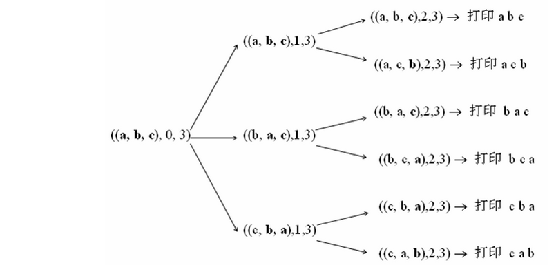

>参考
>
>[字符串全排列问题](http://blog.csdn.net/zhaojinjia/article/details/9320475)
>
>[字符串的全排列和组合算法](http://blog.csdn.net/hackbuteer1/article/details/7462447)

#链接
-------
>牛客OJ：[字符串的排列](http://www.nowcoder.com/practice/fe6b651b66ae47d7acce78ffdd9a96c7?tpId=13&tqId=11180&rp=2&ru=%2Fta%2Fcoding-interviews&qru=%2Fta%2Fcoding-interviews%2Fquestion-ranking)
>
>九度OJ：http://ac.jobdu.com/problem.php?pid=1369
>
>GitHub代码： [028-字符串的排列](https://github.com/gatieme/CodingInterviews/tree/master/028-字符串的排列)
>
>CSDN题解：[剑指Offer--028-字符串的排列](http://blog.csdn.net/gatieme/article/details/51251158)


| 牛客OJ | 九度OJ | CSDN题解 | GitHub代码 |
| ------ |:------:| --------:|:----------:|
|[字符串的排列](http://www.nowcoder.com/practice/fe6b651b66ae47d7acce78ffdd9a96c7?tpId=13&tqId=11180&rp=2&ru=%2Fta%2Fcoding-interviews&qru=%2Fta%2Fcoding-interviews%2Fquestion-ranking) | [1369-字符串的排列](http://ac.jobdu.com/problem.php?pid=1369) | [剑指Offer--028-字符串的排列](http://blog.csdn.net/gatieme/article/details/51251158) | [028-字符串的排列](https://github.com/gatieme/CodingInterviews/tree/master/028-字符串的排列) |


<br>**您也可以选择[回到目录-剑指Offer--题集目录索引](http://blog.csdn.net/gatieme/article/details/51916802)**


#题意
-------

**题目描述**

>输入一个字符串,按字典序打印出该字符串中字符的所有排列
>
>例如输入字符串abc,
>
>则打印出由字符a,b,c所能排列出来的所有字符串abc,acb,bac,bca,cab和cba。
>
>结果请按字母顺序输出。
>
>**注意**
>输入一个字符串,长度不超过9(可能有字符重复),字符只包括大小写字母


**样例输入**

>abc
>
>BCA

**样例输出**

>abc
>acb
>bac
>bca
>cab
>cba
>ABC
>ACB
>BAC
>BCA
>CAB
>CBA

#基于前缀码的全排列（递归）
-------
依次从字符串中取出一个字符作为最终排列的第一个字符，对剩余字符组成的字符串生成全排列，最终结果为取出的字符和剩余子串全排列的组合。


```cpp
class Solution
{
protected:
    vector<string> m_res;

public:
    void Permutation(string prefix, string str)
    {

        if(str.length() == 0)
        {
            //cout << prefix << endl;
            m_res.push_back(prefix);
        }
        else
        {
            for(int i = 0; i < str.length(); i++)
            {
                Permutation(prefix+str[i], str.substr(0,i)+str.substr(i+1,str.length()));
            }
        }
    }

    vector<string> Permutation(string s)
    {
        m_res.clear( );
        if(s.empty( ) == true)
        {
            return m_res;
        }
        Permutation("",s);

        return m_res;
    }
};
```
优点：该方法易于理解，

缺点：但无法移除重复的排列，如：s="ABA"，会生成两个“AAB”。


#基于交换的全排列（递归）
-------

 


由于全排列就是从第一个数字起，每个数分别与它后面的数字交换，我们先尝试加个这样的判断——如果一个数与后面的数字相同那么这两个数就不交换 了。例如abb，第一个数与后面两个数交换得bab，bba。然后abb中第二个数和第三个数相同，就不用交换了。但是对bab，第二个数和第三个数不 同，则需要交换，得到bba。由于这里的bba和开始第一个数与第三个数交换的结果相同了，因此这个方法不行。

换种思维，对abb，第一个数a与第二个数b交换得到bab，然后考虑第一个数与第三个数交换，此时由于第三个数等于第二个数，所以第一个数就不再用与第三个数交换了。再考虑bab，它的第二个数与第三个数交换可以解决bba。此时全排列生成完毕！

很明显，递归的出口，就是只剩一个字符的时候，递归的循环过程，就是从每个子串的第二个字符开始依次与第一个字符交换，然后继续处理子串。

还有一个问题要注意，就是如果字符串中有重复的字符串

这样，我们得到在全排列中去掉重复的规则：
去重的全排列就是从第一个数字起，每个数分别与它后面非重复出现的数字交换。


*    字符串切片成两个部分，一部分是第一个字符，另一部分是第一个字符以后的所有字符

*    接下来我们递归的求后一部分所有字符的全排序

例如对于abc，用递归方法，把列表不断切断如‘abc’,第一次切成‘a’和‘bc’，第二次切成‘ab’和‘c’.
然后把后面的字符串中每一个都与前面的字符串最后一个作交换。
例如（'ab' 与‘c’交换就是，‘ac’和‘b’）最后再排序一下就好。

1.    首先，求所有可能出现在第一个位置的字符，

2.    其次，把第一个字符和其后面的字符一一交换。如下图所示，分别把第一个字符a和后面的b、c等字符交换的情形。

3.    接着，固定第一个字符，求后面所有字符的排列。这个时候我们仍把后面的所有字符分成两部分：后面字符的第一个字符，以及这个字符之后的所有字符。然后把第一个字符逐一和它后面的字符交换

```cpp
#include <iostream>
#include <algorithm>
#include <vector>
#include <string>

using namespace std;

//  调试开关
#define __tmain main

#ifdef __tmain

#define debug cout

#else

#define debug 0 && cout

#endif // __tmain


class Solution
{
protected:
    vector<string> m_res;

public:

    vector<string> Permutation(string str)
    {
        m_res.clear( );

        if(str.empty( ) == true)
        {
            return m_res;
        }
        PermutationRecursion(str, 0);

        sort(m_res.begin( ), m_res.end( ));
        return m_res;
    }


    void PermutationRecursion(string str, int begin)
    {
        if(str[begin] == '\0')
        {
            debug <<str <<endl;
            m_res.push_back(str);
        }
        else
        {
            for(int i = begin;
                str[i] != '\0';
                i++)
            {
                //debug <<str[i] <<str[begin] <<endl;
                if(!HasDuplicate(str, begin, i))
                {
                    swap(str[i], str[begin]);
                    debug <<"swap " <<str[i] <<"(" <<i <<")" <<" and " <<str[begin] <<"(" <<begin <<")" <<endl;
                    PermutationRecursion(str, begin + 1);
                    //copy(str.begin( ), str.degin( ) + i, ostream_iterator<char>(cout," "));
                    swap(str[i], str[begin]);
                }
            }
        }
    }
    
private:
    //find duplicate of str[i] in str[k,i)
    bool HasDuplicate(string& str, int k, int i) const {
		for (int p = k; p < i; p++)
			if (str[p] == str[i]) return true;

		return false;
	}
};

int __tmain( )
{
    Solution solu;
    solu.Permutation("abc");

    return 0;
}
```

#STL的next_permutation求全排列
-------

用STL的next_permutation可以很方便的求一个容器的全排列

```
class Solution
{
public:
    vector<string> Permutation(string str)
    {
        vector<string> res;

        if(str.empty( ) == true)
        {
            return res;
        }
        sort(str.begin( ), str.end( ));

        do
        {
            res.push_back(str);
            debug <<str <<endl;
        }
        while(next_permutation(str.begin( ), str.end( )));


        return res;

    }
};
```

